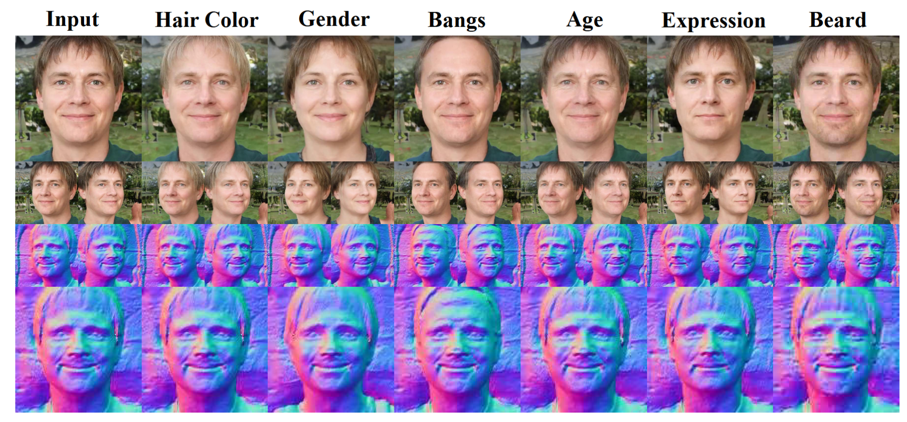

# TT-GNeRF
**Training and Tuning Generative Neural Radiance Fields for Attribute-Conditional 3D-Aware Face Generation**  
[Jichao Zhang](https://zhangqianhui.github.io/), [Aliaksandr Siarohin](https://scholar.google.com/citations?user=uMl5-k4AAAAJ&hl=en), [Yahui Liu](https://scholar.google.com/citations?hl=en&user=P8qd0rEAAAAJ), [Hao Tang](https://scholar.google.com/citations?user=9zJkeEMAAAAJ&hl=en), 
[Nicu Sebe](http://disi.unitn.it/~sebe/), [Wei Wang](https://weiwangtrento.github.io/) <br>
[paper](https://arxiv.org/pdf/2208.12550.pdf) [Demo-Video](https://ttgnerf.github.io/TT-GNeRF/)<br>
Ocean University of China, Snap Research, Huawei, Peking University, University of Trento, Beijing Jiaotong University


## Environments

```
conda create -n ttgnerf python=3.6
```
```
pip install -r req.txt
```

## Results

 

### Editing (EG3D)

Please edit the file training/loss.py to change the path of BiSeNet model. You can download [BiSeBet](https://drive.google.com/file/d/1s887f2x2rYGVOVgwB-Tusas7CB1KQu2E/view?usp=drive_link) from the given pretrained
model path.

```
python test_kmeans.py --outdir=[output_path] \
            --network=[pretrained eg3d model] \
            --dataset_path [our dataset path] \
            --csvpath [label path] \
            --batch=1 \
            --gen_pose_cond=True \
            --resolution 512 \
            --label_dim 6 \
            --truncation_psi 0.7 \
            --file_id 66 \
            --lambda_normal 1.0
```

```       
python test_editing_triot.py --outdir=[output_path] \
            --network=[pretrained eg3d model] \
            --dataset_path [our dataset path] \
            --csvpath [label path] \
            --cnf_path=[cnf pretrained model path] \
            --mask_path=[output_path_mask] \
            --batch=1 \
            --gen_pose_cond=True \
            --resolution 512 \
            --label_dim 6 \
            --truncation_psi 0.7 \
            --scale 1.2 \
            --finetune_id 0 \
            --file_id 66 \
            --num_steps 100 \
            --lambda_normal 5.0 \
            --norm_loss 0
```

### Reference Image Geometry Transfer

```
python test_reference_geometry_editing.py --outdir=[output_path] --batch=1 \
            --gen_pose_cond=True --num_steps 100 \
            --faceid_weights [face_id_path] \
            --w_dir [our dataset path] \
            --resolution 512 --truncation_psi 0.7 --id 41 --ref_id 5235
```

## Pretrained Model and Dataset

[our dataset path](https://drive.google.com/file/d/18pHM_MSp7CJ78SyXlVhRXXdLY7ivujGh/view?usp=drive_link):

[face_id_path](https://drive.google.com/file/d/18pHM_MSp7CJ78SyXlVhRXXdLY7ivujGh/view?usp=drive_link):

[cnf pretrained model path](https://drive.google.com/file/d/1_8r71EGVUwi8REq-PWMP1BJh5OlU0LJh/view?usp=drive_link):

[label path](https://drive.google.com/file/d/1UhpkuvEE4XLUggv1nwBz9Rflpnpxo85y/view?usp=drive_link):

[pretrained eg3d model](https://drive.google.com/file/d/1uBWGRbnhMxuJCYVryV4YeEO4JxBJBoE_/view?usp=drive_link): 

# Questions

If you have any questions/comments, feel free to open a github issue or pull a request or e-mail to the author Jichao Zhang (jichao.zhang@unitn.it).

# Reference code

We would like to thank [EG3D](https://github.com/NVlabs/eg3d) and [StyleFlow](https://github.com/RameenAbdal/StyleFlow) for providing such a great and powerful codebase.